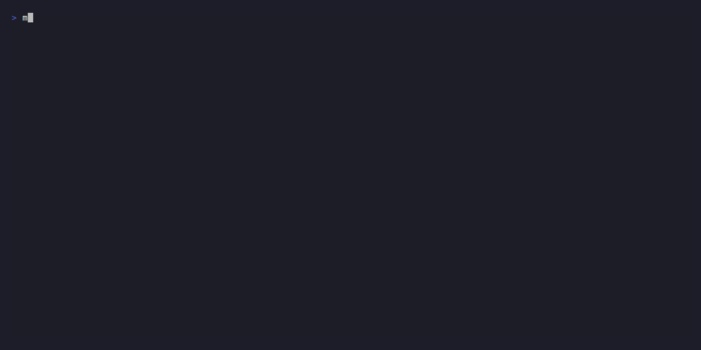

# Modkeel

> **Compile the mods Mojang left behind**


[](https://github.com/Modkeel/modkeel/actions/workflows/cli.yml)

---

Modkeel is a CLI tool that finds, compiles, and verifies unofficial Minecraft mod forks for versions the original authors don't support. When Mojang releases a patch version (like 1.21.10), major mods skip it -- but community forks exist on GitHub as uncompiled branches. Modkeel finds them, builds them, and validates the output.

Playing the mods, not building them? The [Modkeel Companion](https://github.com/Modkeel/companion)
mod backs up your worlds when your mods change and fixes crashes in one click.

## Quick Start

```bash
git clone https://github.com/Modkeel/modkeel.git
cd modkeel && pip install -e .
modkeel compile repos.txt -m 1.21.10 -l neoforge -lv 64 -t "$(cat github_token.txt)"
```

## Quick Demo

### Search for a mod


### Compile mods from a list


### Check status


> GIFs generated with [VHS](https://github.com/charmbracelet/vhs). See [`demo/README.md`](demo/README.md) to regenerate.

## How It Works

For each repository in your list, Modkeel runs:

1. **Modrinth Check** -- Search for a pre-compiled JAR first (skip compilation if found)
2. **Fork Discovery** -- Search GitHub for compatible forks and independent ports
3. **Branch Scoring** -- Rank branches by version match, loader match, and freshness
4. **Pre-validation** -- Check `gradle.properties` via GitHub API before cloning
5. **Cross-loader Fallback** -- If no NeoForge match, try Fabric forks via Sinytra Connector
6. **Compile** -- Clone, run `gradlew build`, validate output JAR
7. **Multi-pass Dependencies** -- Retry failed mods with `mavenLocal()` after others succeed
8. **Docker Testing** (opt-in) -- Boot a headless MC server to verify mods load

## Requirements

- **Python 3.10+**
- **Git** (in PATH)
- **JDK 17 or 21** (for Gradle compilation)
- **Docker** (optional, for `--docker-test`)

```bash
python --version  # 3.10+
git --version
java -version     # 17 or 21
```

## Installation

```bash
git clone https://github.com/Modkeel/modkeel.git
cd modkeel
pip install -e .
```

This installs the `modkeel` CLI command and all dependencies.

## Usage

### Compile Mods

```bash
modkeel compile repos.txt \
  --mc-version 1.21.10 \
  --loader neoforge \
  --loader-version 64 \
  --github-token "$(cat github_token.txt)"
```

### Compile and Install to Instance

```bash
modkeel compile repos.txt \
  -m 1.21.10 -l neoforge -lv 64 \
  --instance "/path/to/minecraft/instance" \
  -t "$(cat github_token.txt)"
```

### Compile and Test in Docker

```bash
modkeel compile repos.txt \
  -m 1.21.10 -l neoforge -lv 64 \
  --docker-test \
  -t "$(cat github_token.txt)"
```

### Search Without Compiling

```bash
modkeel search "Create" -m 1.21.10 -l neoforge -t "$(cat github_token.txt)"
```

### Get One Mod

```bash
modkeel get "Create" -m 1.21.10 -l neoforge -lv 21.10.64
```

`get` (and `search`, without downloading) tries, in order, and prints what it tried:

1. The mod's official build for that Minecraft version.
2. An official build for an older version of the same line that still runs on it: its
   metadata must allow your version, every Minecraft class it uses must exist there, and
   no method or field it calls may have been removed or renamed since the version it was
   built for. A static check, so test it in game (or with `--docker-test`).
3. A community fork compiled for that version (needs a token and `-lv`).
4. Last resort: an older official build refused only by its declared Minecraft range. Modkeel
   adds your version to that range, but keeps the result only if its bytecode resolves and a
   headless server boots with it (needs Docker). The file is renamed `...+modkeel-relaxed-...`
   and carries `META-INF/modkeel-relaxed.txt`.

It never downloads a different mod with a similar name: addons are listed separately.

`compile` follows the same order for each repository, with one more step after the official
build: the author's own branch for that version, prebuilt or compiled, comes before an older
build. `--strict` never uses an older build. The report says which source each mod came from
and, for failures, everything that was tried.

### Check Status

```bash
modkeel status
```

> **Legacy:** `python mod_auto_compiler.py ...` still works but is deprecated. Use `modkeel compile` instead.

## Repository File Format

The `repos.txt` file contains one repository URL per line:

```
# Base URL -- Modkeel finds the best branch automatically
https://github.com/Creators-of-Create/Create
https://github.com/mezz/JustEnoughItems

# Specific branch
https://github.com/PepperCode1/Continuity/tree/1.21.10/dev

# Comments start with #
```

## Command Reference

### `modkeel compile`

| Option | Description | Default |
|--------|-------------|---------|
| `repos_file` | Text file with repository URLs | (required) |
| `-m`, `--mc-version` | Minecraft version | (required) |
| `-l`, `--loader` | Mod loader: `neoforge`, `forge`, `fabric` | (required) |
| `-lv`, `--loader-version` | Loader version number | (required) |
| `-i`, `--instance` | Minecraft instance path | -- |
| `-o`, `--output-dir` | Output directory | `out` |
| `-t`, `--github-token` | GitHub API token | -- |
| `--strict` | Require exact MC version match | off |
| `--no-cross-loader` | Disable Sinytra Connector fallback | off |
| `--docker-test` | Test mods in Docker server | off |
| `--docker-timeout` | Docker timeout (seconds) | 180 |
| `--output-report` | Save report to file | -- |
| `--log-file` | Write log to file | -- |
| `--no-share` | Skip anonymous data sharing (sharing is not live yet) | off |

### `modkeel search`

| Option | Description | Default |
|--------|-------------|---------|
| `query` | Mod name to search | (required) |
| `-m`, `--mc-version` | Minecraft version | (required) |
| `-l`, `--loader` | Mod loader | `neoforge` |
| `-t`, `--github-token` | GitHub API token | -- |

### `modkeel status`

No arguments. Shows version, config, cached loaders, and known NeoForge versions.

## GitHub API Token

Without a token you're limited to 60 API requests/hour. With a token: 5,000/hour.

1. Go to [github.com/settings/tokens](https://github.com/settings/tokens)
2. **Generate new token** > **Tokens (classic)**
3. Select scope: **`public_repo`** (only permission needed)
4. Save the token: `echo "ghp_xxx..." > github_token.txt`

## Troubleshooting

| Error | Cause | Fix |
|-------|-------|-----|
| `gradle.properties not found` | Branch lacks Gradle files | Try a different branch |
| `Compilation timeout (>10 min)` | Large mod or slow machine | Build manually with `./gradlew build` |
| `GitHub API rate limit exceeded` | No token or too many requests | Use `--github-token` |
| `minecraft_version is X, expected Y` | Branch targets wrong version | Expected -- Modkeel tries the next branch |
| `No JAR file found in build/libs` | Unusual output path | Check `build.gradle` |
| `JAR declares incompatible MC version` | Misconfigured `mods.toml` | Try another branch |

## Contributing

See [CONTRIBUTING.md](CONTRIBUTING.md) for development setup, testing, and PR guidelines.

## License

MIT License -- see [LICENSE](LICENSE) for details.
